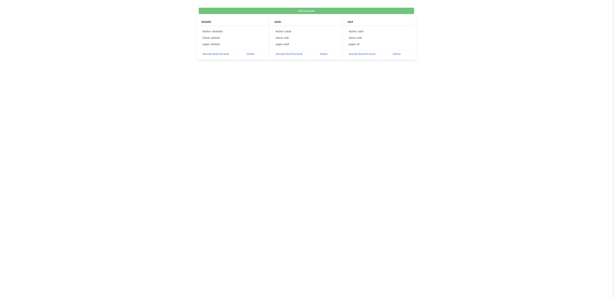

# Simple-JS-UI-Library-
Microverse JavaScript Library-v1.1
This is the first project in the Microverse Javascript module. The goal of the project is to learn basic JS code structure.

## Project screenshot

## 🔨 Built in

- JavaScript
- Bootstrap 4

## 🚀 Our Project

Our project can be found at https://github.com/Ceejayski/Simple-JS-UI-Library-
## Live Demo

You can find the demo [here](https://ceejayski.github.io/Simple-JS-UI-Library-/)

## To run the project in local

- clone the repository from here [repo link](https://github.com/Ceejayski/Simple-JS-UI-Library-)
- navidate to the folder `Simple-JS-UI-Library-`
- open index.html with your browser

## 👨🏽‍💻 👨🏿‍💻 Creators

👤 **Author1**

- Github: [@ceejayski](https://github.com/ceejayski)
- LinkedIn: [LinkedIn](https://www.linkedin.com/in/okoli-ceejay/)
- Twitter: [Twitter](https://twitter.com/OkoliChijioke10)

## 🤝 Contributing

Contributions, issues and feature requests are welcome!

Feel free to check the [issues page](https://github.com/daviidy/Micro-Reddit/issues).

## Show your support

Give a ⭐️ if you like this project!

## 📝 License

This project is no licensed.
 curriculum 
